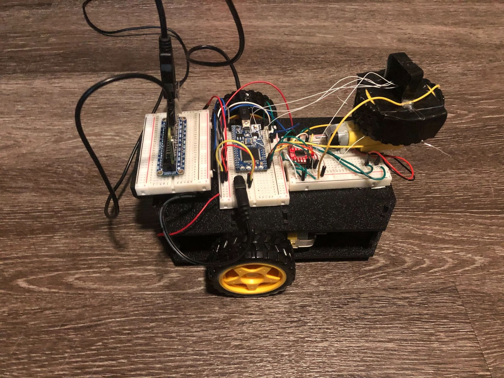
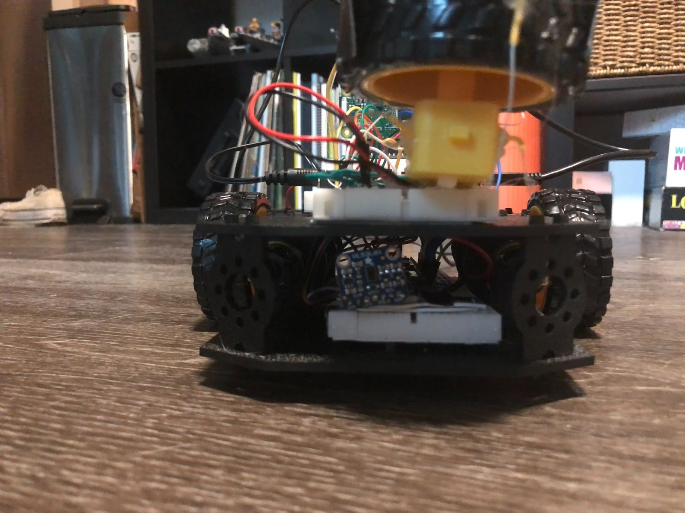
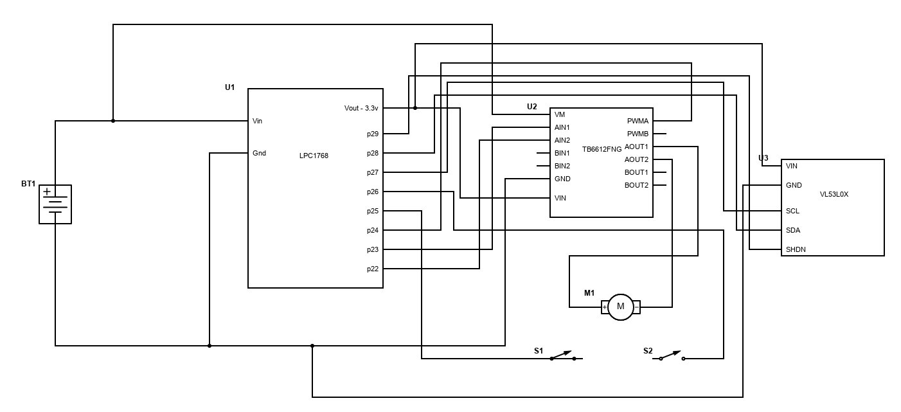
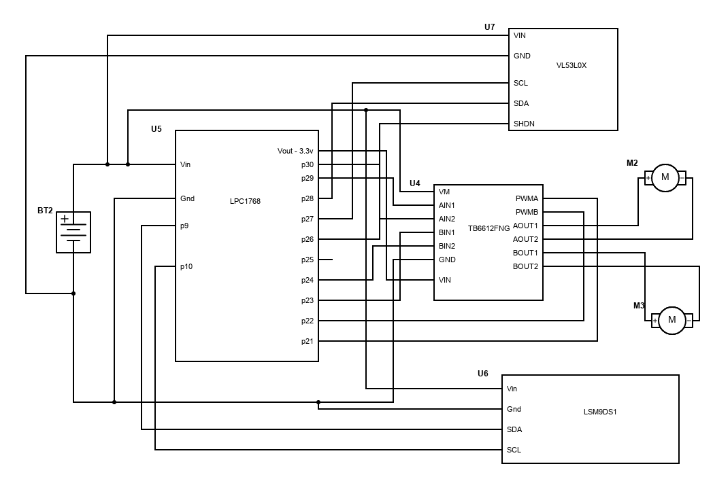
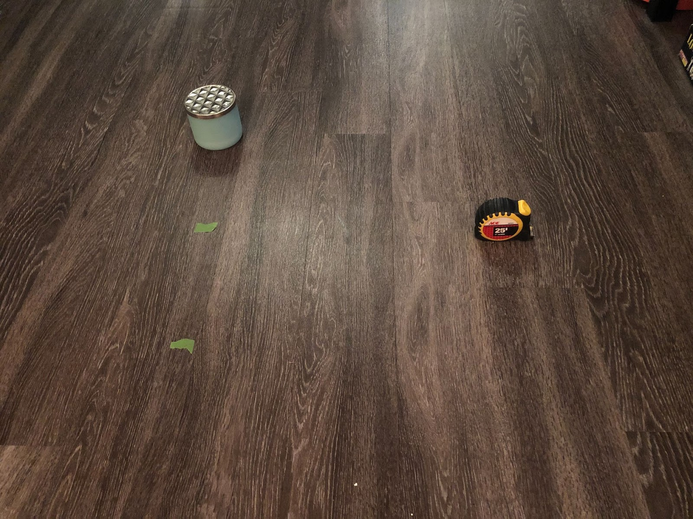
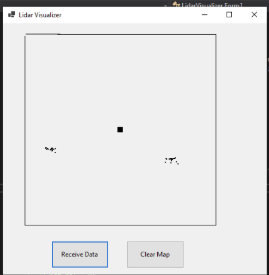

# Slam-bot
### Sarah McDougal and Sam Scheele

This page details a SLAM (simultaneous localization and mapping) robot that was built as a final project for ECE 4180 at Georgia Tech. To view source code for this project, please click the blue "view on GitHub" button in the upper-right corner of this webpage.

## Project Idea

The intention of this project was to create a simple, cheap, and easily reproducible SLAM robot. This was accomplished using only parts found in the 4180 Mbed kits, which are easily found on Sparkfun. The robot uses a lidar sensor mounted on a cheap brushed DC motor to sense its surroundings, and performs position estimation using an IMU and dead reckoning. Two more brushed DC motors are used for navigation.

## Components List

- 2x Mbed LPC1768
- Raspberry Pi Zero W
- Magician Chassis/Robot kit: https://www.sparkfun.com/products/retired/10825
- Extra DG01D-A130 gearbox/motor/wheel (for lidar platform - the Magician Chassis kit comes with two gearbox/motor/wheel combinations, but a third is required)
- LSM9DS1 9dof IMU (https://www.sparkfun.com/products/13284)
- 2x VL53L0X LIDAR distance sensor (https://www.adafruit.com/product/3317)
- 2x TB6612FNG dual H-bridge (https://www.pololu.com/product/713)

## Design Overview

The Raspberry Pi serves to process sensor data from the lidar and serve a webpage with current mapping data, while the mbeds are responsible for control and real-time components. To assemble the project, create the schematics found below using the components listed above. Connect the Mbed responsible for controlling the sensing platform to the Raspberry Pi with a USB cable. The portion of the design responsible for the robot's motion follows the design of the Magician Chassis/Robot kit from the components list, then the sensing portion is placed on top. The second lidar sensor and the mbed responsible for motor control are mounted on the lower level. The second lidar sensor serves to detect obstacles directly in front of the robot.

### Sensor platform

Since no encoders were available to use on the sensor platform, we instead estimate platform rotation in the following manner: two wires are attached to pins 25 and 26 on the mbed, and set as pullup inputs. The wires are sufficiently stiff that they retain their shape when bent and spring back after light contact with other surfaces. The wires define the left and right edge of the arc which the sensor platform can travel. A third wire, connected to ground, is attached to the edge of the sensor platform such that it will contact one of the first two wires when the platform is rotated to a certain position. By attaching interrupts to the falling edges of pins 25 and 26, we can know exactly when the platform reaches on of these positions. Using the total time to complete a sweep from one wire to the other, as well as the time elapsed between the start of the sweep and a lidar detection event, and assuming a constant angular velocity of the platform, we extrapolate the angle of the sensing platform at each detection event. 

## Schematics
The first schematic shows how to attach the first mbed to the sensor platform on top of the robot. The open switches on pins 25 and 26 are the wires at each edge of the platform's arc, as described in the "Sensor platform" section.

The second schematic shows how the second mbed is attached to both of the robot's wheels, the IMU, and the second lidar sensor (used for collision avoidance).

## Results
Here is an image of our test setup for the robot:

Here is an image of the robot's lidar map of the setup:

Though there is minimal noise in the lidar map, the robot has clearly constructed a functional map of the obstacles and terrain. It is also able to navigate around the obstacles, as can be seen in the video demo.

## Video Demo

[Link to video](https://youtu.be/4pujMloFdC0)

## Future Work
The solid-state lidar IC on a rotating platform worked well for this project, and was a great deal easier and cheaper than typical lidar solutions. With slight enhancements, such as an encoder, a slip ring, and potentially a couple of additional lidar ICs, this could replace much more expensive lidar solutions.

This project used extraneous parts, including an extra LPC1868 and lidar chip. Though this made sense for our group, as the project was easier to complete this way and we had the parts anyway, a more effecient solution could be created which doesn't require these extra components.
